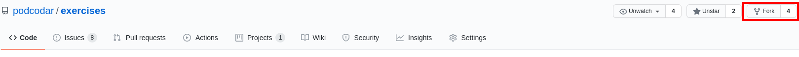
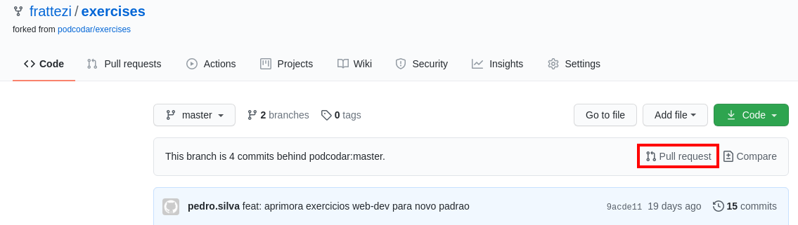
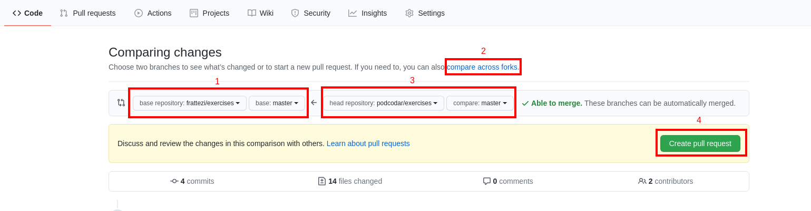
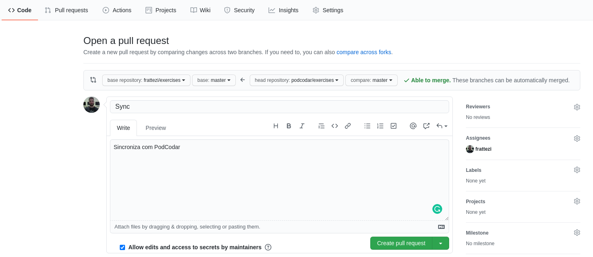
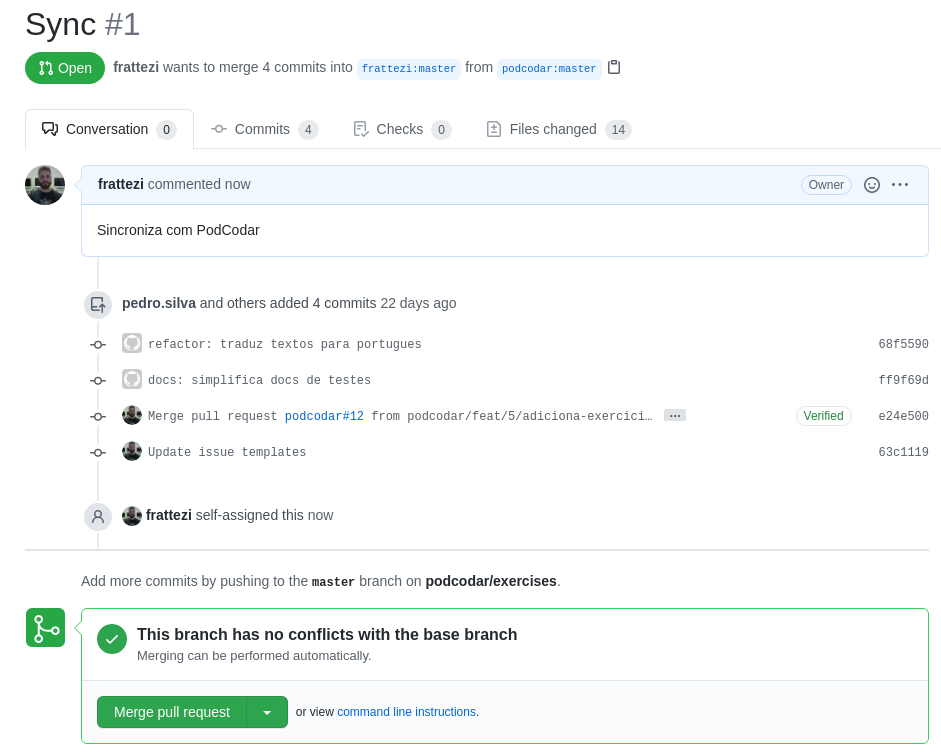

# Exercícios

Listas de exercícios da PodCodar, os exercícios se relacionam com as trilhas, logo,
para cada trilha vão haver exercícios propostos + exercícios recomendados.

## Trilhas

- 1 - [Learning the basics](./programming-basics/README.md)
  - Lógica de programação
  - Git
  - Linguagem de programação
- 2 - [Web Development](./web-development/README.md)
  - HTML
  - CSS
  - Javascript
  - BootStrap
- 3 - Advanced Web Development
  - React
  - Typescript
  - Express

## Como fazer os exercícios

Primeiro você deve fazer um **fork** desse repositório na sua conta pessoal. Cada lista de exercícios tem sua prórpia doc que descreve como fazer e validar seus exercícios relacionados.

O **Fork** é uma forma de criar uma cópia do repositório **podcodar/exercises** para sua conta Github pessoal, isto facilita para que outros desenvolvedores consigam tirar dúvidas e discutir seus exercícios com você além de manter seu código pessoal organizado. Lembre-se de manter seu repositório pessoal sempre atualizado!

### Rotina para usar o exercises

Com o passar do tempo o repositório **podcodar/exercises** será atualizado por colaboradores, isto quer dizer que novos exercicios, documentações, tutoriais e projetos serão adicionados, gerando mais conteúdo para seus estudos.

Para se manter atualizado é necessário atualizar o seu repositório pessoal com as novas inclusões feitas no repositório original da PodCodar. É possível fazer isto utilizando a interface do Github:octocat:!

Quando existirem novas modificações você verá a seguinte mensagem na pagina inicial do seu repositório:

Clique no botão com a mensagem **Pull Request**, isto te levará a página de criação de pull requests, isto permitirá que você crie um novo pedido de alterações que terá todas as últimas atualizações feitas pela **PodCodar**

Nesta tela siga os 4 passos:

1. Selecione **podcodar/exercises** como *base repository* e **master** como *base*
2. Após o passo 1 sua tela irá recarregar e você deverá cliclar em **compare across forks**  antes de ir para o passo 3.
3. Selecione **podcodar/exercises** em *head repository* e **master** como *base*
4. Clique em **Create pull request**

Você será redirecionado para a página de criação, ela demonstra quais alterações serão inseridas no seu código

Por padrão colo Sync no título e o texto `Sincroniza com PodCodar` na mensagem, após isto clique em **Create pull request**.

Por fim, se tudo estiver certo o Github irá demonstrar a seguinte tela

Ela lista as alterações feitas  e serve como uma documentação das modificações inseridas. Caso não existam *conflitos*(se ocorrer procure alguem da PodCodar para te auxiliar) clique em **Merge pull request**.

Presto :raised_hands: ! Você pode continuar desenvolvendo normalmente, o seu repositório foi atualizado!

---

Em caso de dúvidas em um exercício específico temos um canal aberto no **Discord**, acesse:

- [Para se inscrever no canal](https://discord.gg/VMUcbkhGbE)
- [Para tirar dúvidas](https://discord.com/channels/694536762038550549/771788063936348161) com outros desenvolvedores da **PodCodar**.

## PodContribuir

Visite a doc do [Contributing](./CONTRIBUTING.md) e as [issues](https://github.com/podcodar/exercises/issues) deste repositório para ver como contribuir com novos exercícios!
