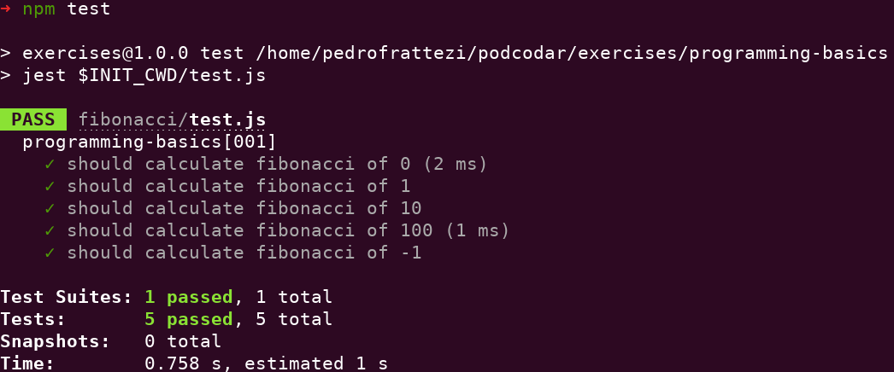

# Fibonacci

Neste exercício iremos calcular os valores da sequência de **Fibonacci**.

Na matemática, a Sucessão de Fibonacci (ou Sequência de Fibonacci), é uma sequência de números inteiros, começando normalmente por 0 e 1, na qual, cada termo subsequente corresponde à soma dos dois anteriores.

Os números de Fibonacci são, portanto, os números que compõem a seguinte sequência:

```sh
0, 1, 1, 2, 3, 5, 8, 13, 21, 34, 55, 89, 144, 233, 377, 610, 987, 1597, 2584, ...
```

Usando a convenção calculamos aqui os primeiros valores

```javascript
fib(1) = 1
fib(2) = 2
fib(3) = 3
fib(4) = 5
.
.
.
fib(10) = 55
```

Logo a entrada do problema será um **número inteiro** e a saída também será **um número inteiro**.

## Requisitos

Instalar as dependências do `programming-basics`, siga o tutorial [aqui](../README.md)

## Testando

Após isso acesse a pasta deste exercício e rode o comando `npm test`.

Isso irá conferir se sua resposta está atendendo os requisitos esperados.


